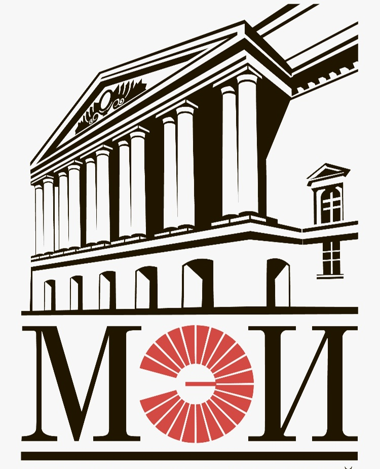
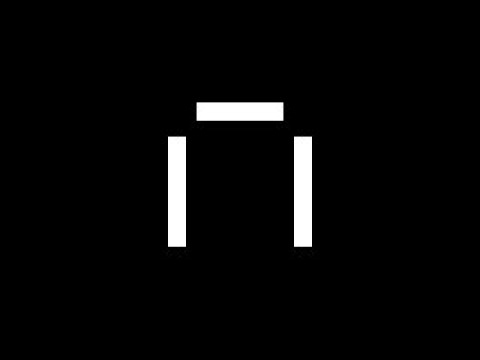

<!-- Header Animation -->

  

<!-- Stats -->

  
  
  

 

<!-- About -->

<h3>💫 About Me</h3>

🚀 Dedicated **C++ / Qt Developer** building high-performance desktop applications.  

💻 Strong expertise in **Qt (Widgets & QML)**, multithreading, system architecture and low-level optimization.  

⚡ Focused on **performance, parallelism and GPU computing**.  

🌱 Currently exploring: **Modern C++23, CUDA, OpenCL, Design Patterns, Linux internals**.

 

---

<!-- Education Section -->
<h3 align="center">🎓 Education</h3>

<table align="center" width="100%" cellpadding="10">
  <tr>
    <td width="50%" align="center" valign="top">
      
        
      <b>Master’s Degree in High-Performance Computing Systems</b>
       
      <i>Moscow Power Engineering Institute (MPEI)</i>
       
      <small>2024 – 2026</small>
    </td>
    <td width="50%" align="center" valign="top">
      
        
      <b>Bachelor’s Degree in Computer-Aided Design Systems</b>
       
      <i>Moscow Power Engineering Institute (MPEI)</i>
       
      <small>2019 – 2024</small>
    </td>
  </tr>
</table>

<!-- Courses Section -->
<h3 align="center">📜 Courses & Certifications</h3>

<table align="center" width="100%" cellpadding="10">
  <tr>
    <td width="50%" align="center" valign="top">
      
        
      <b>Web Developer Plus</b>
       
      <i>Yandex Practicum</i>
       
      <small>2023 – 2024</small>
    </td>
    <td width="50%" align="center" valign="top">
      
        
      <b>Project Management: Essentials & Digital Services</b>
       
      <i>Moscow Power Engineering Institute (MPEI)</i>
       
      <small>2024</small>
    </td>
  </tr>
</table>

---

<h3 align="center">💻 Core Tech Stack</h3>

  

  

---

<h3 align="center">🛠️ Tools & Environments</h3>

 

---

<h3 align="center">📈 GitHub Analytics</h3>

  
  

---

  
  

    <i>"Code is like humor. When you have to explain it, it’s bad."</i> 
    Professional <b>C++ / Qt / HPC</b> profile.
  

